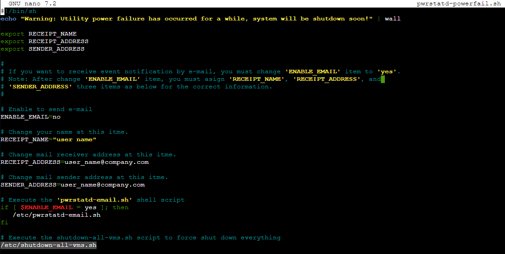

# Purpose
I was using the stock shutdown script that comes with the Cyberpower PowerStat package, and it just runs a `shutdown` command on the host.  This doesn't work well when dealing with some VMs, so I wrote a custom script to help out.  

There's two versions:

## Simple
It's set up to try to shutdown the VMs first, then if not possible will instead stop (kill) them less gracefully.  It needs to be run as a sub-script of the Cyberpower script, or you can just configure PowerStat to run it as a cmd itself before trying to shut down the host.

## Advanced
You can edit the list of tags at the top of this script, and if it finds a VM that is tagged with anything from that list then it will attempt to suspend to disk (hibernate) the VM instead of shut it down.  Once it gets through all of the VMs it checks for running VMs again, then defaults to shutdowns, then checks again, then kills the survivors.  Will likely take a few minutes longer to run than the simple version but less of a chance of VMs not shutting down and needing to be killed, so there's that.

# Setting up
Create a script file in `/etc` and paste the contents of `shutdown-all-vms.sh` into it.  Modify as needed for your environment.

In my homelab I'm using a Cyberpower UPS, which uses PowerStat (aka Cyberpower Power Panel) to monitor the UPS as well as shut it down.  Triggering the shutdown script can be done by any system, in my case this is what I did:

1. Download and install PowerStat
    `curl -o cyberpowerpowerpanel.deb https://www.cyberpower.com/tw/en/File/GetFileSampleByType?fileId=SU-18070001-06&fileType=Download%20Center&fileSubType=FileOriginal`
    `dpkg -i cyberpowerpowerpanel.deb`
2. You can then run `pwrstat -status` to ensure it's connected and working.  If you don't see something, try running `lsusb` to make sure that the UPS is connected to the host
3. Triggering the shutdown script you have a few options:
    a. Edit one of the PowerStat scripts in `/etc`, such as `pwrstatd-powerfail.sh` to run this script itself, this way you can also have it trigger an email alert to you if you want
    
    b. Include the shutdown script in the `cmd` option of the `pwrstat` command when configuring things, such as `pwrstat -pwrfail -active on -delay 60 -cmd /etc/shutdown-all-vms.sh -shutdown on`...this will cause PowerStat to wait 60 seconds after a loss of power, then run the shutdown script, and then shutdown the host itself

When triggered the script should loop through any running VMs, try to shut them down with a 30 second timeout each, and if it fails then move on to trying to force stop them.  Depending on how many VMs you have this may take several minutes.  On my homelab I usually have at least four Linux VMs (including a Docker host running about 20 containers) and a few Windows VMs, so shutting them all down can take 6 to 7 minutes.  After that the host itself has to shut down, so make sure you factor all of this in when picking a UPS.  

My host draws about 180-250W on average and the Cyberpower UPS I have is a 600W/1000VA model so run time should be about 11 to 15 minutes.  That's why I configure things to wait only 60 seconds after power failure (just in case it flickers but comes right back on) before starting the script, and only waiting 30 seconds per VM before giving up and moving on.  I'm much less concerned about killing a VM and corrupting it (I have backups) than I am about power to the host going down fully and corrupting my ZFS disks.
